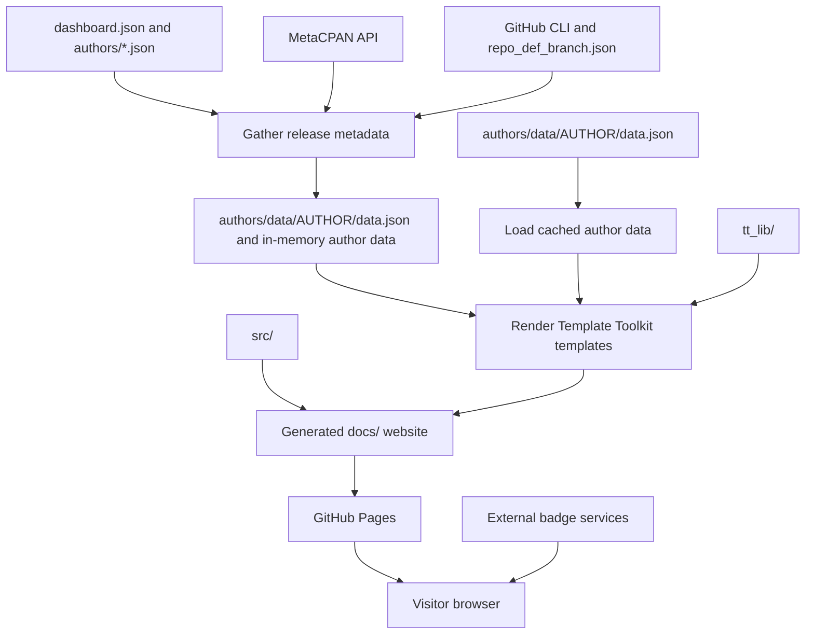

# CPAN Dashboard: repository overview

This repository generates **CPAN Dashboard**, a static website that helps Perl
authors see the state of their CPAN distributions. Each author gets a table of
releases, repository links, release dates, bug trackers, and badges for versions,
distribution quality, continuous integration, and test coverage. The configured
site domain is `cpandashboard.com`.

The application runs when the site is generated. It fetches metadata, writes JSON
and HTML, and leaves ordinary files for a web server to serve. Visitors' browsers
load badge images directly from external services and use JavaScript to search,
sort, and paginate the tables. There is no application server or database in the
normal serving path.

This overview describes the source and workflows examined on 10 October 2026.
It explains the current implementation, including differences from the older
setup instructions in [README.md](README.md).

## How the pieces fit together



A normal run gathers live data and updates the persistent author snapshots;
`--build` loads those same snapshots. HTML and downloadable JSON are rendered
from the same author data. The generated site is disposable; deleting `docs/`
does not discard the last-known-good author data.

## Repository map

| Path | Role |
| --- | --- |
| [bin/dashboard](bin/dashboard) | Command-line entry point; chooses gathering, building, or both. |
| [lib/Dashboard/App.pm](lib/Dashboard/App.pm) | Active application: configuration, MetaCPAN retrieval, repository parsing, caching, and site generation. |
| [lib/Dashboard/BadgeMaker.pm](lib/Dashboard/BadgeMaker.pm) | Produces linked badge image HTML for the dashboard tables. |
| [lib/Dashboard/Repository.pm](lib/Dashboard/Repository.pm), [lib/Dashboard/BranchCache.pm](lib/Dashboard/BranchCache.pm) | Shared repository URL validation, shell-free GitHub CLI lookup, and last-known-good branch caching. |
| [lib/Dashboard/Config.pm](lib/Dashboard/Config.pm) | Global configuration validation and shared author/CI/sort normalization. |
| [lib/Dashboard/Author.pm](lib/Dashboard/Author.pm), [lib/Dashboard/Distribution.pm](lib/Dashboard/Distribution.pm) | Separate class-based data model, exercised by some tests but unused by the main entry point. |
| [dashboard.json](dashboard.json) | Global paths, template names, analytics setting, and sitemap domain. |
| `authors/*.json` | Per-author registration and CI configuration. |
| `authors/data/*/data.json` | Checked-in author snapshots used by `--build`. |
| [repo_def_branch.json](repo_def_branch.json) | GitHub default-branch cache, keyed by repository owner and name. |
| [refresh_branch_cache](refresh_branch_cache) | Refreshes all existing entries in the branch cache using `gh`. |
| `tt_lib/` | Template Toolkit templates for author dashboards, the home page, shared page wrapper, onboarding page, and sitemap. |
| `src/` | Files copied into the generated site: CSS, JavaScript, images, favicon, robots file, custom domain file, and an older onboarding HTML page. |
| `docs/` | Generated website. Ignored by Git and uploaded as the Pages artifact. |
| [.github/workflows/](.github/workflows/) | Generation, deployment, cache refresh, onboarding dispatch, and development setup workflows. |
| [cpanfile](cpanfile) | Declared Perl dependencies. |
| `t/` | Module-loading checks, local application tests, and tests that query MetaCPAN. |

The working tree also contains untracked scripts and data such as
`refresh_github_data`, `github_repo.json`, and `test_app.pl`. These are local
artifacts rather than part of the tracked generation workflow. The existing
local changes were left untouched during this examination.

## Generation, step by step

### 1. Choose the stages and load configuration

`bin/dashboard` constructs `Dashboard::App` and calls its `run` method. Without
arguments, it runs both stages. If any options are supplied, only explicitly
requested stages are enabled:

| Command | Behavior |
| --- | --- |
| `perl -Ilib bin/dashboard` | Gather live metadata, then build the site. |
| `perl -Ilib bin/dashboard --gather` | Gather metadata and update persistent snapshots and the branch cache; leave the published site untouched. |
| `perl -Ilib bin/dashboard --build` | Load checked-in snapshots and build the site without gathering metadata. |
| `perl -Ilib bin/dashboard --gather --build` | Explicitly run both stages. |
| `perl -Ilib bin/dashboard --help` | Print usage and exit. |

Run these commands from the repository root. Global configuration, templates,
static assets, output paths, and the branch cache are resolved relative to the
working directory, including the configured author and snapshot directories.

### 2. Gather release metadata

`Dashboard::App::gather_data` reads the branch cache, then visits every
`authors/*.json` file. For each configured CPAN author it asks `MetaCPAN::Client`
for the author's name, HTTPS Gravatar URL, and releases. The client uses an
`HTTP::Tiny` user agent identifying itself as `CPAN Dashboard/1.0.0`.

Each release becomes a hash containing fields such as:

- `name`, `dist`, `ver`, `auth`, and the date without its time component;
- `repo`, `repo_owner`, `repo_name`, and, when available, `repo_def_branch`;
- `bugtracker`, `uses_rt`, and `insecure_repo`.

The repository URL comes from release metadata, preferring
`resources.repository.web` to `resources.repository.url`. Supported URL forms
are parsed to identify an owner and repository name. GitHub default branches are
looked up through `gh repo view` when the cache lacks a usable entry. Failed
lookups warn and preserve the previous value; unresolved entries are retried on
later runs. Repeated failures are suppressed within one run.
Branch-dependent badges are blank when no valid branch is known.
Distributions without a repository, or with a non-GitHub repository, still appear
in the table; GitHub-specific badges require GitHub repository details.

The application sorts releases by release name, applies default table-sort
settings, and atomically writes the combined author configuration and complete
release data to `authors/data/AUTHOR/data.json` (or the configured `data_dir`).
Snapshots include `gathered_at`, the UTC timestamp of the successful fetch.
It saves the updated default-branch cache after gathering all authors.

Transient retrieval failures are retried up to `fetch_attempts` times with
exponential backoff capped at ten seconds between attempts. The HTTP request
timeout is `http_timeout` seconds. HTTP 408/429/5xx codes and common network/server
failure reason messages are treated as transient; other failures are not retried.
If retrieval still fails, the app reads the persistent last-known-good snapshot.
Logs identify the author, error, snapshot path, and previous gather time; the
dashboard displays a cached-data warning. Missing or invalid fallback data stops
generation with an explicit error. Partial release lists never replace snapshots.

### 3. Alternatively, load snapshots

With `--build`, the application loads `authors/data/*/data.json` directly and
overlays the corresponding registration's current GitHub username, CI settings,
distribution overrides, and sort settings. It makes no metadata requests and does
not rewrite persistent snapshots. HTML and JSON use the same effective settings.
Adding an author configuration alone still requires a first successful gather
before that author has release metadata available for a cached build.

At examination time, the checkout had 26 author configurations and 23 snapshots.
`GDT`, `MIKKOI`, and `WWILLIS` had configurations but no checked-in snapshot.

### 4. Render the website

`Dashboard::App::build_site` creates a Template Toolkit renderer and then:

1. Copies `src/` into the configured output directory.
2. Renders `tt_lib/dashboard.tt` to `AUTHOR/index.html` for each loaded author.
3. Writes that same in-memory author data to `AUTHOR/data.json` in the configured
   output directory.
4. Renders `tt_lib/index.tt` to the site's root `index.html`.
5. Renders configured additional pages, currently `add/index.html` and `status/index.html`.
6. Writes `sitemap.xml` with author, home, and additional-page URLs.

The shared `page.tt` wrapper supplies navigation, page metadata, external CSS and
JavaScript, analytics, advertising, and a UTC rebuild timestamp. The sitemap
opts out of this HTML wrapper. The generated onboarding page overwrites the
older `src/add/index.html` copied in the first step, so `tt_lib/add.tt` is the
effective source for that page.

HTML and downloadable JSON always use the same data, including when gathering
falls back to a previous snapshot. Gathering updates the persistent data while
building only updates the disposable site output.

## Configuration and badges

The current global configuration separates input and output paths:

- `static_dir`: static source directory, currently `src`;
- `input_dir`: template directory, currently `tt_lib`;
- `output_dir`: generated output directory, currently `docs`;
- `author_dir`: author registration files, currently `authors`;
- `data_dir`: persistent author snapshots, currently `authors/data`;
- `branch_cache_file`: persistent GitHub default-branch cache;
- `fetch_attempts`, `http_timeout`, and `retry_delay`: retrieval attempt limit,
  request timeout, and initial backoff delay (defaults: 3, 20 seconds, 1 second);
- `index_template`, `author_template`, and `wrapper`: primary template names;
- `page_templates`: additional page names, currently `["add", "status"]`;
- `domain`: domain used in the sitemap;
- `analytics`: analytics identifier exposed to the templates.

Configuration is validated before fetching or generating files. Errors identify
the source file and field. Output must be separate from static sources, templates,
registrations, snapshots, and the branch cache, including paths containing `..`
or existing symlinks. The top-level `menu` is passed to the wrapper and rendered
with escaped titles and links. Canonical/social URLs and `src/CNAME` still name
`cpandashboard.com` directly; changing domain requires updating those sources.

The `/status/` page and `/status/data.json` describe the last successful site
build. They report recovered MetaCPAN failures with the cached snapshot date,
failed GitHub branch lookups, and unsupported repository URLs. Raw exceptions
remain in build logs; public reports contain predefined messages and identifiers.
Cached builds explicitly state that they did not check current service availability.
Fatal failures cannot publish a new status page, so the page links to generation
workflow logs. Badge-image availability is evaluated by the browser, not the build.

During development, select one author with `perl -Ilib bin/dashboard --author
CPANID`. Add `--build` for a cached build or `--gather` to update just its snapshot.
Author-only invocation still runs both stages by default. `--config FILE` selects
an alternative global configuration; relative paths use the working directory.
Single-author builds create a partial index and sitemap and leave existing output
files alone. Configure a separate output directory for these development builds.
The normal publication workflow continues processing all authors.

Per-author files use this shape:

```json
{
  "author": {
    "cpan": "AUTHORID",
    "github": "github-user"
  },
  "ci": {
    "use_gh_actions": 1,
    "gh_workflow_names": ["CI"],
    "use_coveralls": 1,
    "use_codecov": 0
  },
  "distribution_ci": {
    "Example-Dist": {
      "use_coveralls": 0,
      "gh_workflow_names": [],
      "gh_workflow_files": ["test.yml"]
    }
  },
  "sort": {
    "column": "date",
    "direction": "desc"
  }
}
```

The example selects release-date ordering. Sort columns are `name` (or `repo`)
and `date`, with `asc` or `desc` direction. Legacy numeric settings `0` and `3`
are accepted and normalized to names. The browser finds the current index from
the header's `data-sort-name` attribute, so adding or moving columns preserves
the intended ordering. Other column settings are rejected. Missing settings
default to name ascending.

CPAN version and CPANTS quality badges are always included, including distributions
without a repository or with GitLab/Bitbucket repositories. GitHub-specific
services do not create links for those rows. Author-level flags enable columns for
GitHub Actions, Travis `.org` or `.com`, Cirrus, AppVeyor, Coveralls, and Codecov.
Each row inherits these settings, with optional changes in `distribution_ci`,
keyed by CPAN distribution name. Overrides replace only supplied fields; an empty
list replaces the inherited list, and a zero flag disables that service for that
distribution. Disabled cells remain aligned with the rest of the table.

GitHub Actions display names come from `ci.gh_workflow_names`, workflow filenames
from `ci.gh_workflow_files`, and Cirrus tasks from `ci.cirrus_task_names`. Workflow
filenames use GitHub's documented `actions/workflows/FILE/badge.svg` endpoint;
names use the legacy name-based route. Names are URL encoded and badge attributes
are HTML escaped. See [GitHub's badge documentation](https://docs.github.com/en/actions/how-tos/monitor-workflows/add-a-status-badge).

If a distribution does not define the author's default workflow, disable its
GitHub Actions flag or override its workflow list. A workflow that has not run,
or a service that cannot supply a public image, may still have no usable badge.
The browser shows the local fallback image, including failures that happened
before initialization, and avoids repeatedly retrying a missing fallback.

`BadgeMaker` constructs links and image URLs; it does not run CI jobs or collect
coverage results. The relevant services must already be configured in the
distribution's repository. CI and coverage image availability is separate from
the metadata gathered when the site builds.

In the browser, Bootstrap provides styling and jQuery DataTables provides table
searching, pagination, and ordering. Headers with `data-sort-name` are orderable.
Pages without a dashboard table do not initialize DataTables or require author
sort globals. `src/js/dashboard.js` also replaces failed badge images
with `/images/missing_image.png`.

## Running and checking it locally

Use **Perl 5.40 or later**. The modules use Perl's experimental `class` feature
and field readers, rather than a third-party object framework. `cpanfile`
declares `JSON`, `Path::Tiny` (at least 0.125), `Template`, `MetaCPAN::Client`,
`HTTP::Tiny`, and `URI`.

With a suitable Perl and `cpanm` installed, the basic workflow is:

```sh
cpanm --installdeps .
mkdir -p docs
perl -Ilib bin/dashboard --build
python3 -m http.server 8000 --directory docs
```

Open `http://localhost:8000/`. Building from snapshots avoids MetaCPAN and GitHub
lookups; the rendered pages still use external badge images and CDN assets when
viewed in a browser.

For a live gather-and-build, install and authenticate GitHub CLI (`gh auth login`,
or a suitable token environment variable), allow access to MetaCPAN and GitHub,
and run `perl -Ilib bin/dashboard`. The command can modify
`repo_def_branch.json` as well as generated files.

Useful checks are:

```sh
prove -Ilib t/00-load.t t/app.t
prove -Ilib t
node t/dashboard-js.test.cjs
```

The first command runs module-loading and local release-parsing/badge checks.
The full default suite also exercises the separate `Author`/`Distribution`
classes using fixed fixtures and tests the repository helper and branch cache
with a stub GitHub CLI. It requires neither network access nor credentials.
The default tests do not depend on the experimental `github_repo.json`.
The Node.js checks execute the browser script with a small jQuery/DataTables
fixture to verify reordered columns and initialization on pages without tables;
they do not constitute a real-browser rendering test.

During this examination, the first command passed **14 tests across two files**
using Perl 5.42.3. An isolated build using copied source and snapshots succeeded,
producing 23 author HTML pages and JSON files, the home and onboarding pages,
copied assets, and a sitemap with 25 URLs. Live gathering, browser rendering,
and deployment were not exercised. The subsequent robustness work adds an
offline end-to-end suite covering combined, gather-only, build-only, and CLI
builds, HTML/JSON consistency, retry/fallback behavior, partial iteration failure,
Unicode metadata, and atomic snapshot write failure.

## Automation and publication

[regenerate.yml](.github/workflows/regenerate.yml) runs on pushes to `master`,
manual dispatch, and every six hours at minute 7, as defined by its cron schedule.
It uses a `perl:latest` container, installs GitHub CLI and Perl dependencies,
creates `docs/`, and runs both generation stages with `PERL5LIB=lib` and the
workflow's GitHub token.

For `PerlToolsTeam/dashboard`, the workflow also commits changed tracked files
back to the repository. Since `docs/` is ignored, the website itself is published
through an uploaded Pages artifact rather than committed HTML. A dependent job
deploys that artifact to GitHub Pages.

[rebuild_cache.yml](.github/workflows/rebuild_cache.yml) refreshes the default
branch cache weekly at Monday 00:00 UTC and on manual dispatch, committing it
back only for the upstream repository. The script uses the same validated lookup
as the application. Failed or empty lookups preserve valid cache entries, and
writes use atomic file replacement.

The documented onboarding path in `tt_lib/add.tt` is to add an author JSON file
through a pull request. A separate [add_user.yml](.github/workflows/add_user.yml)
handles an `add_user` repository-dispatch event, but its helper
[bin/add_user](bin/add_user) only converts the payload to configuration JSON and
prints it to standard error. It does not save a file, open a pull request, or
register an author by itself.

The remaining development setup workflow installs Perl 5.40 and dependencies;
it does not run the test suite. The generation workflow runs `prove -Ilib t`
before generating or publishing pages. A separate test workflow runs on pushes
and pull requests with Perl 5.40 and 5.42. The branch-refresh workflow explicitly
sets up Perl 5.40 before loading the shared cache class.

Supported configuration limits are 1–5 fetch attempts, 1–60 seconds per HTTP
request, and 0–10 seconds for initial backoff. CI flags accept 0/1 or JSON booleans;
workflow/task lists contain non-empty names and default to empty arrays. All
registrations are checked, including duplicate CPAN IDs, before the first author
is fetched. Snapshots receive the same author/CI/sort validation before rendering.

## Where to start when changing the project

For metadata collection or cache behavior, start with `Dashboard::App`. For a
dashboard column, work through `dashboard.tt` and `BadgeMaker`. For layout or
browser behavior, start with `page.tt`, `src/css/style.css`, and
`src/js/dashboard.js`. For author registration, add an `authors/AUTHORID.json`
file and use live gathering to see its effect.

The `Author` and `Distribution` classes appear to be an unfinished alternate
model: they use `distributions` and longer field names such as `distribution`
and `version`, while the active app, snapshots, and templates use `modules`,
`dist`, and `ver`. Both models now use the same repository validation and branch
cache; neither reads `github_repo.json`. They are not drop-in replacements for
the current app's hash-based data flow. Treat their integration as a code change
that needs explicit design and verification.

GitHub repository metadata accepts HTTP(S), `git://`, `ssh://git@github.com/`,
and `git@github.com:owner/repo` URLs. Validation checks the hostname and two-part
repository path, then normalizes valid GitHub links to HTTPS. Subpages, query
strings, fragments, credentials in HTTP URLs, and malformed components cannot
trigger GitHub lookups or badges. CLI calls use separate arguments without a
shell, including calls from the cache-refresh script.
