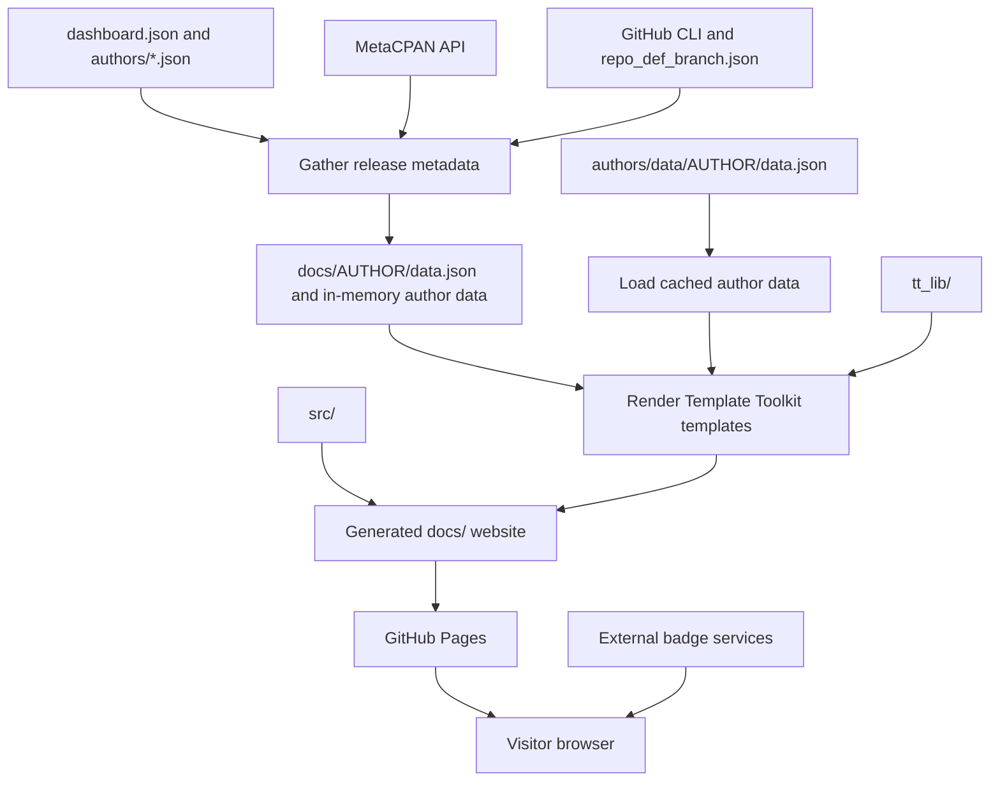

# CPAN Dashboard: repository overview

This repository generates **CPAN Dashboard**, a static website that helps Perl
authors see the state of their CPAN distributions. Each author gets a table of
releases, repository links, release dates, bug trackers, and badges for versions,
distribution quality, continuous integration, and test coverage. The configured
site domain is `cpandashboard.com`.

The application runs when the site is generated. It fetches metadata, writes JSON
and HTML, and leaves ordinary files for a web server to serve. Visitors' browsers
load badge images directly from external services and use JavaScript to search,
sort, and paginate the tables. There is no application server or database in the
normal serving path.

This overview describes the source and workflows examined on 10 October 2026.
It explains the current implementation, including differences from the older
setup instructions in [README.md](README.md).

## How the pieces fit together



The two data sources shown above are distinct. A normal run gathers live data;
`--build` loads checked-in snapshots. The renderer also copies existing snapshots
over the downloadable JSON in `docs/`; see the data-handling details below.

## Repository map

| Path | Role |
| --- | --- |
| [bin/dashboard](bin/dashboard) | Command-line entry point; chooses gathering, building, or both. |
| [lib/Dashboard/App.pm](lib/Dashboard/App.pm) | Active application: configuration, MetaCPAN retrieval, repository parsing, caching, and site generation. |
| [lib/Dashboard/BadgeMaker.pm](lib/Dashboard/BadgeMaker.pm) | Produces linked badge image HTML for the dashboard tables. |
| [lib/Dashboard/Author.pm](lib/Dashboard/Author.pm), [lib/Dashboard/Distribution.pm](lib/Dashboard/Distribution.pm) | Separate class-based data model, exercised by some tests but unused by the main entry point. |
| [dashboard.json](dashboard.json) | Global paths, template names, analytics setting, and sitemap domain. |
| `authors/*.json` | Per-author registration and CI configuration. |
| `authors/data/*/data.json` | Checked-in author snapshots used by `--build`. |
| [repo_def_branch.json](repo_def_branch.json) | GitHub default-branch cache, keyed by repository owner and name. |
| [refresh_branch_cache](refresh_branch_cache) | Refreshes all existing entries in the branch cache using `gh`. |
| `tt_lib/` | Template Toolkit templates for author dashboards, the home page, shared page wrapper, onboarding page, and sitemap. |
| `src/` | Files copied into the generated site: CSS, JavaScript, images, favicon, robots file, custom domain file, and an older onboarding HTML page. |
| `docs/` | Generated website. Ignored by Git and uploaded as the Pages artifact. |
| [.github/workflows/](.github/workflows/) | Generation, deployment, cache refresh, onboarding dispatch, and development setup workflows. |
| [cpanfile](cpanfile) | Declared Perl dependencies. |
| `t/` | Module-loading checks, local application tests, and tests that query MetaCPAN. |

The working tree also contains untracked scripts and data such as
`refresh_github_data`, `github_repo.json`, and `test_app.pl`. These are local
artifacts rather than part of the tracked generation workflow. The existing
local changes were left untouched during this examination.

## Generation, step by step

### 1. Choose the stages and load configuration

`bin/dashboard` constructs `Dashboard::App` and calls its `run` method. Without
arguments, it runs both stages. If any options are supplied, only explicitly
requested stages are enabled:

| Command | Behavior |
| --- | --- |
| `perl -Ilib bin/dashboard` | Gather live metadata, then build the site. |
| `perl -Ilib bin/dashboard --gather` | Gather metadata and update generated JSON and the branch cache; skip HTML generation. |
| `perl -Ilib bin/dashboard --build` | Load checked-in snapshots and build the site without gathering metadata. |
| `perl -Ilib bin/dashboard --gather --build` | Explicitly run both stages. |
| `perl -Ilib bin/dashboard --help` | Print usage and exit. |

Run these commands from the repository root. Global configuration, templates,
static assets, output paths, and the branch cache are resolved relative to the
working directory. Author discovery uses paths relative to the executable.

### 2. Gather release metadata

`Dashboard::App::gather_data` reads the branch cache, then visits every
`authors/*.json` file. For each configured CPAN author it asks `MetaCPAN::Client`
for the author's name, HTTPS Gravatar URL, and releases. The client uses an
`HTTP::Tiny` user agent identifying itself as `CPAN Dashboard/1.0.0`.

Each release becomes a hash containing fields such as:

- `name`, `dist`, `ver`, `auth`, and the date without its time component;
- `repo`, `repo_owner`, `repo_name`, and, when available, `repo_def_branch`;
- `bugtracker`, `uses_rt`, and `insecure_repo`.

The repository URL comes from release metadata, preferring
`resources.repository.web` to `resources.repository.url`. Supported URL forms
are parsed to identify an owner and repository name. GitHub default branches are
looked up through `gh repo view` only when the cache lacks an entry. Failed
lookups warn and cache an empty branch. Branch-dependent badges are then blank.
Distributions without a repository, or with a non-GitHub repository, still appear
in the table; GitHub-specific badges require GitHub repository details.

The application sorts releases by release name, applies default table-sort
settings, and writes the combined author configuration and release data to
`docs/AUTHOR/data.json`. It saves the updated default-branch cache after gathering
all authors.

If an author's metadata fetch fails, the application tries to reuse
`docs/AUTHOR/data.json`. If that file does not exist, generation fails. This
fallback does **not** automatically read `authors/data/AUTHOR/data.json`.

### 3. Alternatively, load snapshots

With `--build`, the application loads `authors/data/*/data.json` directly. It does
not fetch metadata or merge changes from `authors/*.json` into those snapshots.
Adding an author configuration alone therefore does not add that author to a
build using snapshots; changing CI flags alone does not update that build either.

At examination time, the checkout had 26 author configurations and 23 snapshots.
`GDT`, `MIKKOI`, and `WWILLIS` had configurations but no checked-in snapshot.

### 4. Render the website

`Dashboard::App::build_site` creates a Template Toolkit renderer and then:

1. Copies `src/` into the configured output directory.
2. Renders `tt_lib/dashboard.tt` to `AUTHOR/index.html` for each loaded author.
3. Copies that author's checked-in snapshot to `docs/AUTHOR/data.json`, if one
   exists.
4. Renders `tt_lib/index.tt` to the site's root `index.html`.
5. Renders configured additional pages, currently `add/index.html`.
6. Writes `sitemap.xml` with author, home, and additional-page URLs.

The shared `page.tt` wrapper supplies navigation, page metadata, external CSS and
JavaScript, analytics, advertising, and a UTC rebuild timestamp. The sitemap
opts out of this HTML wrapper. The generated onboarding page overwrites the
older `src/add/index.html` copied in the first step, so `tt_lib/add.tt` is the
effective source for that page.

**A current data inconsistency:** a gather-and-build run renders HTML from the
freshly gathered in-memory data, but step 3 can replace the fresh downloadable
JSON with an older checked-in snapshot. There is no active step that updates
`authors/data/` from gathering. The two JSON locations should not be treated as
interchangeable caches.

## Configuration and badges

The current global configuration separates input and output paths:

- `static_dir`: static source directory, currently `src`;
- `input_dir`: template directory, currently `tt_lib`;
- `output_dir`: generated output directory, currently `docs`;
- `index_template`, `author_template`, and `wrapper`: primary template names;
- `page_templates`: additional page names, currently `["add"]`;
- `domain`: domain used in the sitemap;
- `analytics`: analytics identifier exposed to the templates.

Some configuration support is incomplete. Several output JSON paths are
hard-coded to `docs/`, and canonical/social URLs and `src/CNAME` name
`cpandashboard.com` directly. The wrapper iterates `output.menu`, whereas the
global configuration has a top-level `menu` that the renderer does not pass in.
Changing global settings alone is therefore insufficient for every deployment
customization.

Per-author files use this shape:

```json
{
  "author": {
    "cpan": "AUTHORID",
    "github": "github-user"
  },
  "ci": {
    "use_gh_actions": 1,
    "gh_workflow_names": ["CI"],
    "use_coveralls": 1,
    "use_codecov": 0
  },
  "sort": {
    "column": 3,
    "direction": "desc"
  }
}
```

The example selects release-date ordering. Browser column indexes are zero-based:
name/repository is `0`, MetaCPAN is `1`, CPANTS is `2`, and date is `3`. The
application currently converts a textual `"date"` sort setting to `2`, which
does not match the template; use numeric `3` for date ordering.

CPAN version and CPANTS quality badges are always included. Author-level flags
enable columns for GitHub Actions, Travis `.org` or `.com`, Cirrus, AppVeyor,
Coveralls, and Codecov. GitHub Actions workflow names come from
`ci.gh_workflow_names`; Cirrus task names come from `ci.cirrus_task_names`.
The same configured workflow/task names apply to every release for an author.

`BadgeMaker` constructs links and image URLs; it does not run CI jobs or collect
coverage results. The relevant services must already be configured in the
distribution's repository. CI and coverage image availability is separate from
the metadata gathered when the site builds.

In the browser, Bootstrap provides styling and jQuery DataTables provides table
searching, pagination, and ordering. Only name/repository and date columns are
configured as orderable. `src/js/dashboard.js` also replaces failed badge images
with `/images/missing_image.png`.

## Running and checking it locally

Use **Perl 5.40 or later**. The modules use Perl's experimental `class` feature
and field readers, rather than a third-party object framework. `cpanfile`
declares `JSON`, `Path::Tiny` (at least 0.125), `Template`, `MetaCPAN::Client`,
`HTTP::Tiny`, and `URI`.

With a suitable Perl and `cpanm` installed, the basic workflow is:

```sh
cpanm --installdeps .
mkdir -p docs
perl -Ilib bin/dashboard --build
python3 -m http.server 8000 --directory docs
```

Open `http://localhost:8000/`. Building from snapshots avoids MetaCPAN and GitHub
lookups; the rendered pages still use external badge images and CDN assets when
viewed in a browser.

For a live gather-and-build, install and authenticate GitHub CLI (`gh auth login`,
or a suitable token environment variable), allow access to MetaCPAN and GitHub,
and run `perl -Ilib bin/dashboard`. The command can modify
`repo_def_branch.json` as well as generated files.

Useful checks are:

```sh
prove -Ilib t/00-load.t t/app.t
prove -Ilib t
```

The first command runs module-loading and local release-parsing/badge checks.
The full suite additionally queries MetaCPAN and exercises the separate
`Author`/`Distribution` classes. It includes an outdated assertion that
DAVECROSS's GitHub username is `davorg`, while the current configuration says
`davorg-cpan`. The separate distribution code also uses `Data::Printer`, which
is absent from `cpanfile`. These make the full suite different from a self-contained
test of the main generation path.

During this examination, the first command passed **14 tests across two files**
using Perl 5.42.3. An isolated build using copied source and snapshots succeeded,
producing 23 author HTML pages and JSON files, the home and onboarding pages,
copied assets, and a sitemap with 25 URLs. Live gathering, browser rendering,
the network-dependent tests, and deployment were not exercised.

## Automation and publication

[regenerate.yml](.github/workflows/regenerate.yml) runs on pushes to `master`,
manual dispatch, and every six hours at minute 7, as defined by its cron schedule.
It uses a `perl:latest` container, installs GitHub CLI and Perl dependencies,
creates `docs/`, and runs both generation stages with `PERL5LIB=lib` and the
workflow's GitHub token.

For `PerlToolsTeam/dashboard`, the workflow also commits changed tracked files
back to the repository. Since `docs/` is ignored, the website itself is published
through an uploaded Pages artifact rather than committed HTML. A dependent job
deploys that artifact to GitHub Pages.

[rebuild_cache.yml](.github/workflows/rebuild_cache.yml) refreshes the default
branch cache weekly at Monday 00:00 UTC and on manual dispatch, committing it
back only for the upstream repository. Unlike the main app's lookup, the refresh
script does not check `gh`'s exit status before replacing a cache entry; a failed
lookup can leave an empty branch value.

The documented onboarding path in `tt_lib/add.tt` is to add an author JSON file
through a pull request. A separate [add_user.yml](.github/workflows/add_user.yml)
handles an `add_user` repository-dispatch event, but its helper
[bin/add_user](bin/add_user) only converts the payload to configuration JSON and
prints it to standard error. It does not save a file, open a pull request, or
register an author by itself.

The remaining development setup workflow installs Perl 5.40 and dependencies;
it does not run the test suite. The generation workflow likewise skips dependency
tests and has no explicit project-test step.

## Where to start when changing the project

For metadata collection or cache behavior, start with `Dashboard::App`. For a
dashboard column, work through `dashboard.tt` and `BadgeMaker`. For layout or
browser behavior, start with `page.tt`, `src/css/style.css`, and
`src/js/dashboard.js`. For author registration, add an `authors/AUTHORID.json`
file and use live gathering to see its effect.

The `Author` and `Distribution` classes appear to be an unfinished alternate
model: they use `distributions` and longer field names such as `distribution`
and `version`, while the active app, snapshots, and templates use `modules`,
`dist`, and `ver`. `Distribution` also has an empty command in its default-branch
lookup. They are not drop-in replacements for the current app's hash-based data
flow. Treat their integration as a code change that needs explicit design and
verification.
